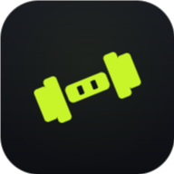

# 🏋️ GymLog — Train. Log. Progress.

A beautiful, **offline-first** gym tracker that runs entirely in your browser.
No accounts, no servers, no subscriptions — your data lives on your device.
Built as a **Progressive Web App** so you can install it to your phone's home
screen and use it at the gym with no internet.



## Features

- **Log workouts** — add exercises, record sets (weight × reps), tick them off
  with an automatic rest timer between sets.
- **Exercise library** — a catalogue covering **every common equipment type**
  (bodyweight, dumbbell, barbell, machine, cable, kettlebell, band). Each move
  shows a **muscle-map picture**, step-by-step how-to, common mistakes, and a
  beginner **rule-of-thumb** for sets, reps, rest and starting weight.
- **Body metrics** — log bodyweight and measurements with trend charts.
- **Progress** — estimated 1-rep-max charts, **personal records**, weekly
  training volume per muscle group, and a consistency calendar / streak.
- **Coach** — built-in, beginner-tuned guidance (progressive overload, rep-range
  targets, rest times, RIR, deloads, protein & sleep).
- **kg ⇄ lb** toggle and **dark / light** themes — switch anytime, losslessly.
- **Backup & restore** — export/import your full history as a JSON file.

## Run it locally

It's plain HTML/CSS/JS — no build step. Serve the folder over HTTP (service
workers and ES modules need `http://`, not `file://`):

```bash
# any static server works, e.g.:
npx serve .
# or
python -m http.server 8080
```

Then open the printed URL on your computer or phone.

## Install on your phone

1. Open the live site in your phone's browser.
2. **iPhone (Safari):** Share → *Add to Home Screen*.
   **Android (Chrome):** menu → *Install app* / *Add to Home screen*.
3. Launch it from the icon — it now works offline.

## Tech

- Vanilla JavaScript (ES modules), no framework, no dependencies.
- Hand-drawn **SVG** charts and muscle maps (offline-safe, no image hosting).
- Fonts (Anton + Hanken Grotesk) vendored locally so it looks right offline.
- `localStorage` for data, with JSON export/import for backup.
- Service worker for full offline support.

## Privacy

Everything stays on your device. Nothing is uploaded anywhere.

---

Made with 💪 and [Claude Code](https://claude.com/claude-code).
